# CI/CD Pipeline — Node.js + Jenkins + Docker + Terraform + Ansible

## Overview

This lab solves a core DevOps problem: **how do you get code from a developer's laptop into production automatically, reliably, and with zero manual steps after the initial setup?**

A manual deployment workflow is slow, error-prone, and doesn't scale. Every push requires someone to SSH into a server, run commands, and hope nothing breaks. This project eliminates all of that by building a full CI/CD pipeline from scratch:

- **Terraform** provisions two EC2 instances (Jenkins + App) with a remote backend, IAM role, and auto-generated Ansible inventory
- **Ansible** configures both servers — installs Docker, Jenkins, Java 21, all plugins, and auto-registers the Node.js tool via a Groovy init script
- **Jenkins** runs a 6-stage declarative pipeline: checkout → install → test → build image → push to Docker Hub → deploy to App EC2
- **Docker Hub** stores versioned images tagged by Jenkins build number

Every `git push` to `main` can trigger a full pipeline run. No SSH, no manual docker commands, no hardcoded IPs.

---

## Objectives

- Provision two EC2 instances with Terraform using a remote S3 backend + DynamoDB state lock
- Attach an IAM role to Jenkins EC2 so it can resolve the App EC2 IP dynamically from tags — no hardcoded IPs
- Auto-generate `inventory.ini` from Terraform outputs via `local_file` resource
- Configure Jenkins, Java 21, Docker, and all required plugins via Ansible — no manual server setup
- Build, test, containerise and deploy a Node.js/Express app through a fully automated Jenkins pipeline
- Push Docker images to Docker Hub tagged with the Jenkins `BUILD_NUMBER` for traceability
- Deploy via private IP over intra-VPC SSH — App EC2 never exposed except on port 3000

---

## Tools & Versions

| Tool             | Version / Detail         |
|------------------|--------------------------|
| Terraform        | >= 1.5.0                 |
| AWS Provider     | ~> 5.0                   |
| Ansible          | 2.x                      |
| Jenkins          | 2.555.1 LTS              |
| Java             | Amazon Corretto 21       |
| Docker           | Latest (Amazon Linux 2)  |
| Node.js          | 16.20.2 (Jenkins tool)   |
| Express          | ^4.18.2                  |
| Mocha / Chai     | ^10.2.0 / ^4.4.1         |
| EC2 AMI          | Amazon Linux 2           |
| Jenkins instance | t3.small                 |
| App instance     | t3.micro                 |
| Region           | eu-west-1                |
| OS (local)       | macOS                    |

---

## Problem This Lab Solves

Manual deployments at any scale lead to:

- **Inconsistency** — "works on my machine" is a real failure mode when humans run deployment steps
- **No audit trail** — who deployed what version, when, and did tests pass?
- **Slow feedback** — developers don't know their code is broken until someone manually tests it
- **Secrets sprawl** — credentials get copy-pasted into terminals, scripts, or Slack messages

This pipeline addresses all four:
- Every build is triggered from the same Jenkinsfile in source control — no human variation
- Build numbers tag every Docker image — you can trace any running container to an exact commit
- Tests run before the image is built — broken code never reaches Docker Hub or the App EC2
- All credentials live in Jenkins credential store, injected at runtime — never in code or on disk

---

## Architecture

```
YOUR MACHINE
│
├── Terraform  → provisions VPC, subnets, IGW, security groups,
│                Jenkins EC2 (t3.small) + App EC2 (t3.micro)
│                IAM role attached to Jenkins EC2
│                writes infra/ansible/inventory.ini automatically
│
└── Ansible    → SSHes into both EC2s
                  Jenkins EC2: installs Java 21, Docker, Jenkins,
                               plugins (NodeJS, SSH Agent, Docker Pipeline…)
                               drops Groovy init script → registers NodeJS-16 tool
                  App EC2:     installs Docker only
                                    ↓
              Jenkins EC2 (t3.small)
              └── Jenkins (port 8080)
                  ├── pulls Jenkinsfile from GitHub on every build
                  ├── resolves App EC2 private IP via IAM + ec2:DescribeInstances
                  └── 6-stage pipeline:
                      Install → Test → Docker Build → Push → Deploy
                                                                ↓
              App EC2 (t3.micro)
              └── Docker container: cicd-node-app (port 3000)
                  pulled from Docker Hub, tagged by BUILD_NUMBER
```

Jenkins uses the **private IP** for intra-VPC SSH to the App EC2. The App EC2 security group only allows SSH from the Jenkins security group — not from the internet.

---

## Project Structure

```
CI-CD-pipeline/
├── Jenkinsfile                  # Declarative pipeline — 6 stages
├── .env.example                 # Environment variable template
├── .gitignore                   # Excludes keys/, .env, state files, inventory.ini
├── README.md                    # This file
├── app/
│   ├── src/
│   │   ├── app.js               # Express app (exported, no port binding)
│   │   └── server.js            # Binds app to PORT or 3000
│   ├── tests/
│   │   └── app-test.js          # Mocha + Chai + Supertest — 5 tests
│   ├── Dockerfile               # Multi-stage: builder + non-root runtime
│   ├── .dockerignore
│   └── package.json             # express, mocha, chai, supertest
├── infra/
│   ├── backend/                 # Stage 1 — S3 bucket + DynamoDB for remote state
│   │   ├── main.tf
│   │   ├── variables.tf
│   │   └── outputs.tf
│   ├── terra-modules/           # Stage 2 — modular EC2 infrastructure
│   │   ├── main.tf              # IAM role, instance profile, modules wired together
│   │   ├── variables.tf
│   │   ├── outputs.tf
│   │   └── modules/
│   │       ├── vpc/             # VPC, subnet, IGW, route table
│   │       ├── security-group/  # Jenkins SG + App SG with SG-reference SSH rule
│   │       └── ec2/             # Key pair + EC2 instance + optional IAM profile
│   └── ansible/
│       ├── site.yml             # Play 1: Jenkins server | Play 2: App EC2
│       └── inventory.ini        # Auto-generated by Terraform (gitignored)
├── keys/                        # SSH key pair — gitignored, never committed
└── screenshoots/                # Evidence screenshots
```

---

## API Endpoints

| Method | Path          | Description                        |
|--------|---------------|------------------------------------|
| GET    | `/`           | Welcome message + version          |
| GET    | `/health`     | Liveness check                     |
| GET    | `/api/items`  | Returns list of items              |
| GET    | `/*`          | 404 handler                        |

---

## Pipeline Stages

| Stage        | What happens                                                                 |
|--------------|------------------------------------------------------------------------------|
| Checkout     | Clones repo; resolves App EC2 private + public IPs via IAM role              |
| Install      | `npm ci` — deterministic install from lock file                              |
| Test         | `npm test` — Mocha suite; pipeline aborts if any test fails                  |
| Docker Build | `docker build -t cedrick13bienvenue/cicd-node-app:BUILD_NUMBER`              |
| Push Image   | `docker push` to Docker Hub using `registry_creds` from Jenkins store        |
| Deploy       | SSH to App EC2 (private IP): pull image, stop old container, run new one     |
| Post (always)| Prune dangling images on both Jenkins EC2 and App EC2                        |

---

## Security Considerations

- Jenkins EC2 has an **IAM role** with `ec2:DescribeInstances` only — no hardcoded credentials, no over-provisioned permissions
- App EC2 SSH is via **intra-VPC private IP** — the SSH security group rule references the Jenkins SG, not a CIDR
- All credentials (`registry_creds`, `ec2_ssh`, `git_credentials`) live in Jenkins credential store — injected at runtime, never in the Jenkinsfile
- Docker container runs as a **non-root user** (`appuser`) — no privilege escalation from inside the container
- SSH access to both EC2s restricted to a single IP (`/32`) via security group
- S3 state bucket has versioning enabled, public access blocked, and server-side encryption
- `npm ci` used instead of `npm install` — deterministic, fails on lock file mismatch

---

## Prerequisites

1. Terraform >= 1.5.0
2. Ansible installed locally
3. AWS CLI configured (`aws configure`)
4. Docker Hub account
5. GitHub repository with a PAT (Personal Access Token)

---

## Usage

### Step 0 — Generate Your SSH Key

```bash
cd CI-CD-pipeline
ssh-keygen -t rsa -b 4096 -f keys/cicd-jenkins-key -N ""
```

Creates:
- `keys/cicd-jenkins-key` — private key, never committed
- `keys/cicd-jenkins-key.pub` — public key, Terraform uploads to AWS

---

### Stage 1 — Bootstrap the Remote Backend

```bash
cd infra/backend
terraform init
terraform apply
```

Type `yes`. Creates:

| Resource | Purpose |
|----------|---------|
| S3 bucket `cicd-jenkins-tf-state` | Stores `terraform.tfstate` remotely |
| DynamoDB table `cicd-jenkins-tf-lock` | Locks state during apply |

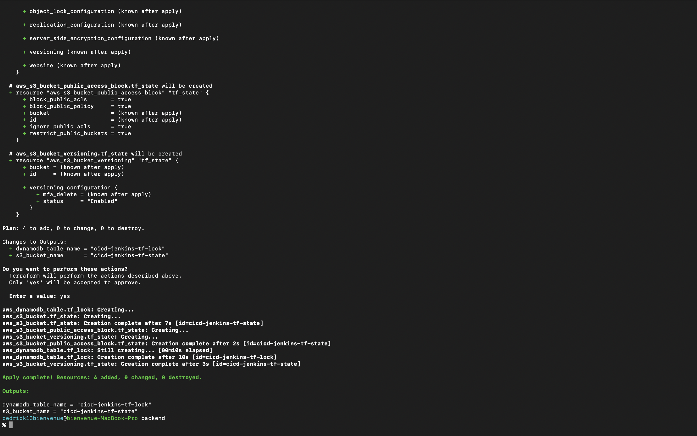

---

### Stage 2 — Deploy EC2 Infrastructure

```bash
cd ../terra-modules
terraform init
terraform apply
```

When prompted for `my_ip`, enter your public IP in CIDR notation (`x.x.x.x/32`). To avoid the prompt on future runs, create `terraform.tfvars`:

```hcl
my_ip = "x.x.x.x/32"
```

Creates:

| Resource | Purpose |
|----------|---------|
| VPC | Private network in eu-west-1 |
| Subnet | eu-west-1a — where both EC2s live |
| Internet Gateway + Route Table | Public internet access |
| Jenkins Security Group | SSH (22) + port 8080 from your IP |
| App Security Group | SSH from Jenkins SG (VPC-internal) + port 3000 from anywhere |
| IAM Role + Instance Profile | Allows Jenkins to call `ec2:DescribeInstances` |
| Jenkins EC2 (t3.small) | Runs Jenkins, IAM profile attached |
| App EC2 (t3.micro) | Runs the Docker container |
| `infra/ansible/inventory.ini` | Auto-generated with real EC2 IPs |

Outputs:

```
jenkins_url     = "http://<jenkins_ip>:8080"
app_url         = "http://<app_ip>:3000"
ansible_command = "cd infra/ansible && ansible-playbook -i inventory.ini site.yml"
```

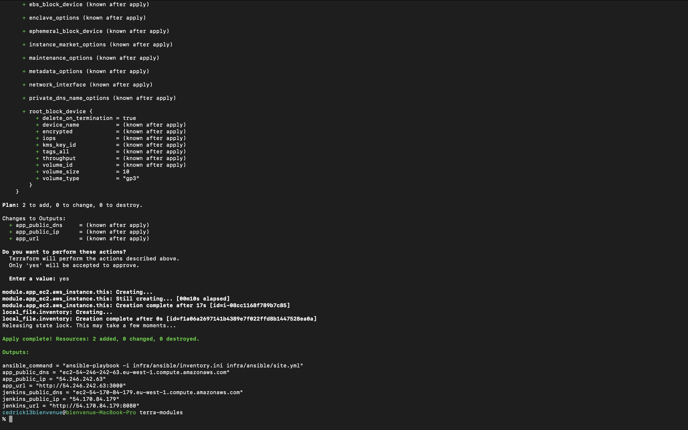

---

### Stage 3 — Configure EC2 Servers with Ansible

```bash
cd ../ansible
ansible-playbook -i inventory.ini site.yml
```

**Play 1 — Jenkins EC2:**

| Task | What happens |
|------|-------------|
| Amazon Corretto 21 | Jenkins LTS requires Java 21+ — Corretto is Amazon's own OpenJDK build |
| Docker | Installed via `amazon-linux-extras` |
| Jenkins | Installed from the official stable RPM repository |
| Jenkins plugins | Installed via plugin manager JAR: git, pipeline, docker, ssh-agent, nodejs, credentials-binding |
| NodeJS-16 Groovy init script | Dropped into `init.groovy.d/` — registers the `NodeJS-16` tool on startup |
| Jenkins restart | Picks up all plugins and the init script |

**Play 2 — App EC2:**

| Task | What happens |
|------|-------------|
| Docker | Installed and started — ready to pull and run containers |

Final output should show `failed=0` on both hosts.

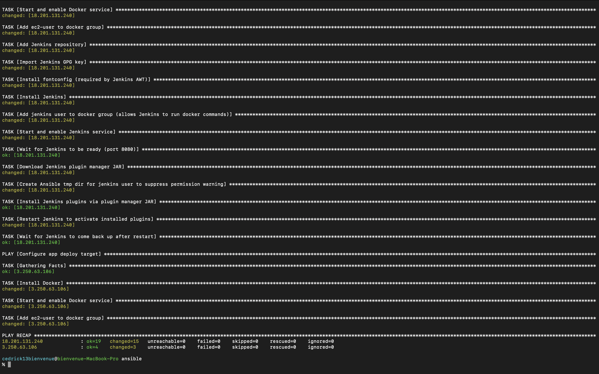

---

### Stage 4 — Configure Jenkins

Open `http://<jenkins_ip>:8080`.

**4a — Unlock Jenkins**

```bash
ssh -i keys/cicd-jenkins-key ec2-user@<jenkins_ip>
sudo cat /var/lib/jenkins/secrets/initialAdminPassword
```

Paste the password into the unlock screen.

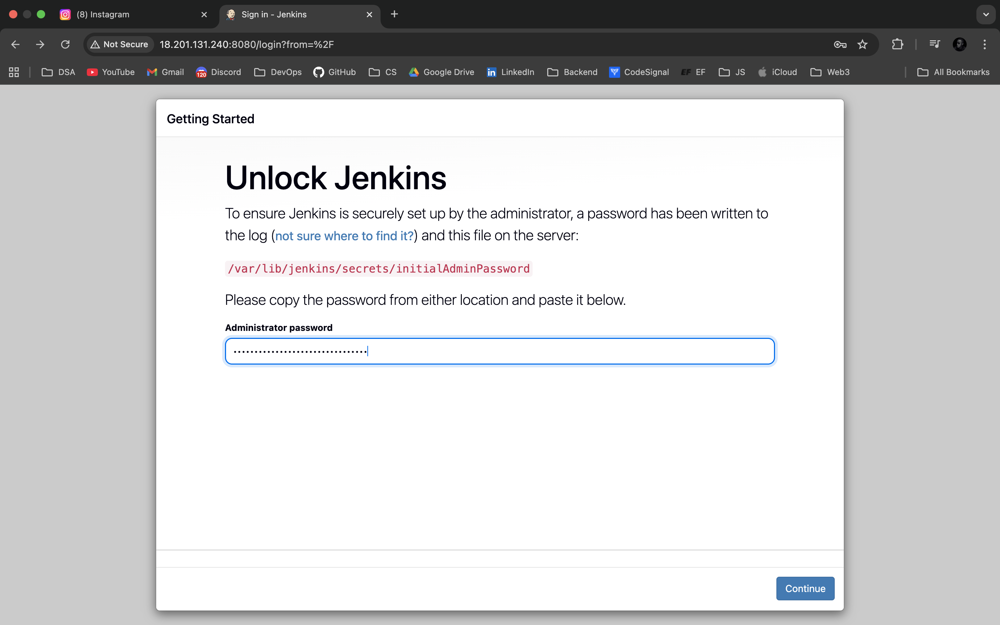

**4b — Skip plugin installation** (all plugins were installed by Ansible) and create your admin user.

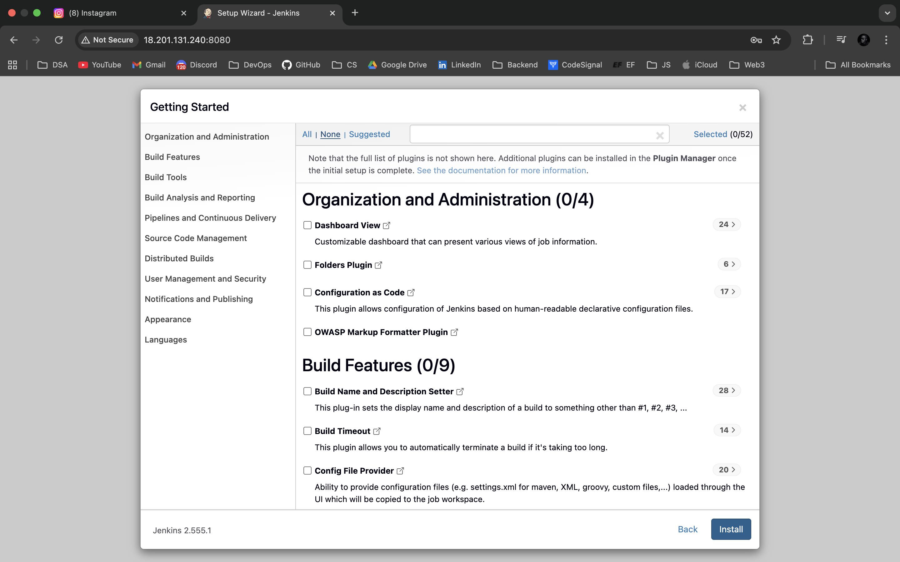

**4c — Add credentials** (Manage Jenkins → Credentials → Global → Add Credentials):

| ID | Type | What |
|----|------|------|
| `registry_creds` | Username/Password | Docker Hub username + password |
| `ec2_ssh` | SSH Username with private key | `ec2-user` + contents of `keys/cicd-jenkins-key` |
| `git_credentials` | Username/Password | GitHub username + Personal Access Token |

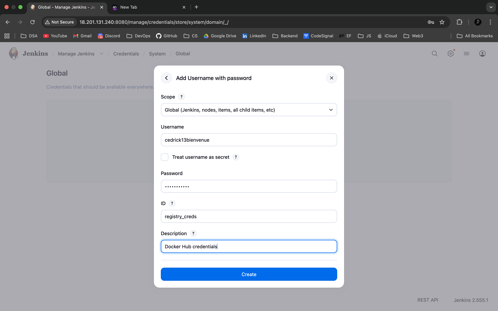

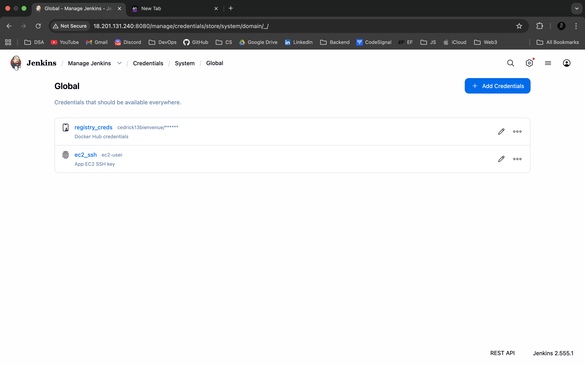

**4d — Create pipeline job**

New Item → Pipeline → name it `cicd-pipeline` → Pipeline section:
- Definition: **Pipeline script from SCM**
- SCM: **Git**
- Repository URL: `https://github.com/cedrick13bienvenue/CI-CD-pipeline.git`
- Credentials: select `git_credentials`
- Branch: `*/main`

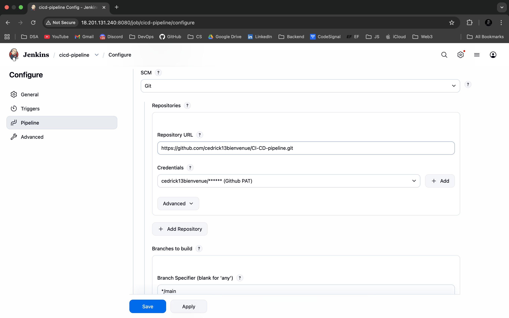

---

### Stage 5 — Run the Pipeline

Push the Jenkinsfile to GitHub:

```bash
git add Jenkinsfile
git commit -m "Add Jenkinsfile: declarative pipeline with 6 stages"
git push
```

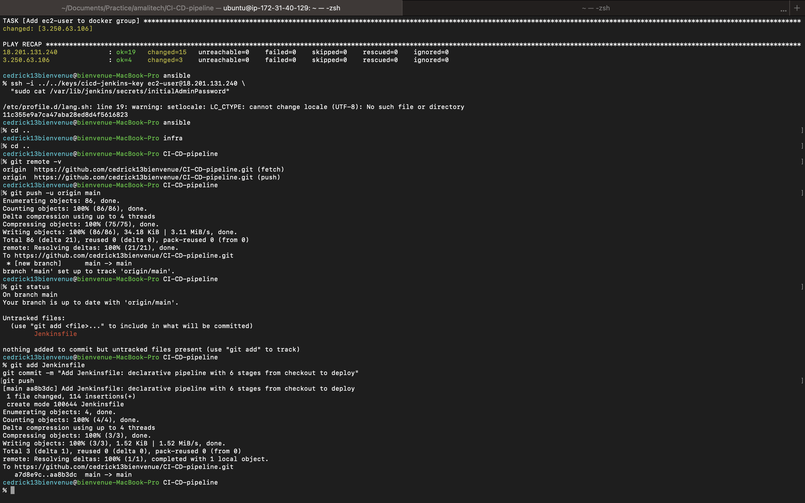

Click **Build Now** in Jenkins. Watch the 6 stages execute:

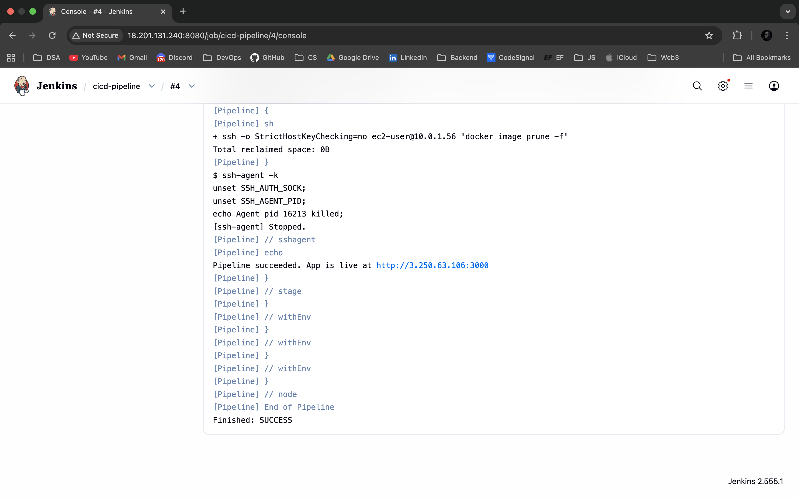

App is live:

```
http://<app_public_ip>:3000
```

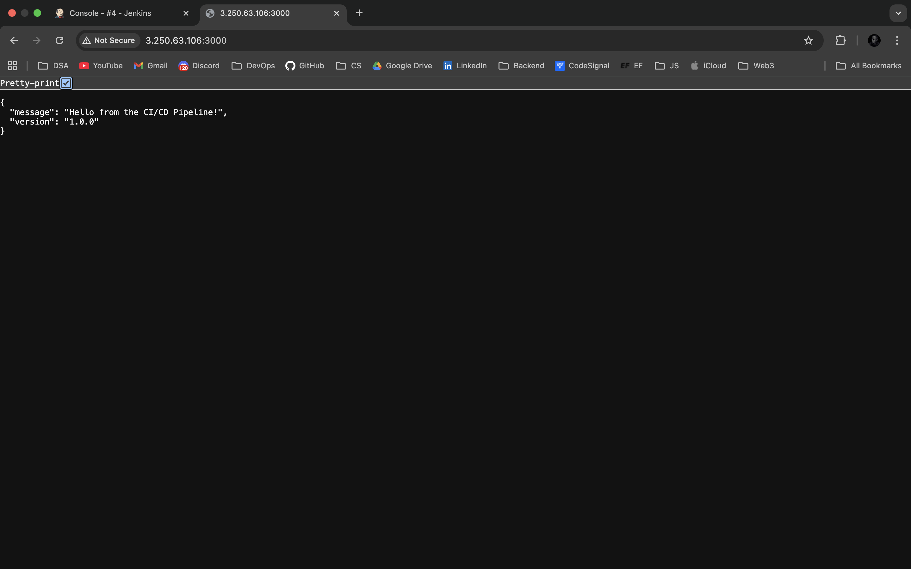

Docker Hub shows the image pushed with the build number tag:

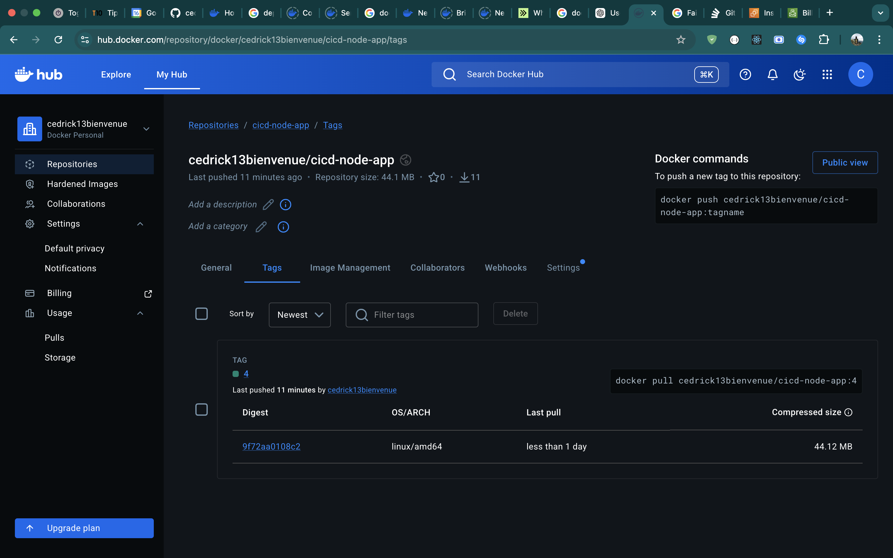

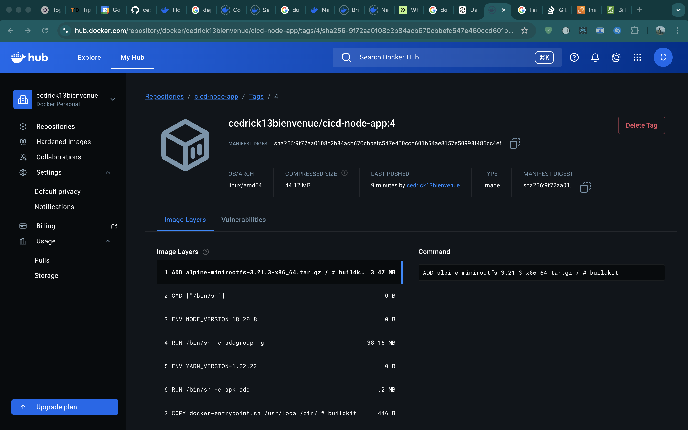

---

### Stage 6 — Teardown (Reverse Order)

```bash
# Destroy main infrastructure first
cd infra/terra-modules
terraform destroy

# Then destroy the backend
cd ../backend
terraform destroy
```

Always destroy main infra before the backend — the backend holds the state file. Destroying it first causes Terraform to lose track of what to clean up.

---

## Resources Deployed

| Resource | Name | Details |
|----------|------|---------|
| VPC | cicd-jenkins-vpc | CIDR: 10.0.0.0/16 |
| Public Subnet | cicd-jenkins-public-subnet | CIDR: 10.0.1.0/24, eu-west-1a |
| Internet Gateway | cicd-jenkins-igw | Attached to VPC |
| Route Table | cicd-jenkins-public-rt | Route: 0.0.0.0/0 → IGW |
| Jenkins Security Group | cicd-jenkins-jenkins-sg | SSH + 8080 from my IP |
| App Security Group | cicd-jenkins-app-sg | SSH from Jenkins SG, port 3000 public |
| IAM Role | cicd-jenkins-jenkins-role | `ec2:DescribeInstances` only |
| Jenkins EC2 | cicd-jenkins-jenkins | t3.small, IAM profile attached |
| App EC2 | cicd-jenkins-app | t3.micro |

---

## Remote Backend

| Component | Name | Purpose |
|-----------|------|---------|
| S3 Bucket | `cicd-jenkins-tf-state` | Stores terraform.tfstate |
| DynamoDB Table | `cicd-jenkins-tf-lock` | State locking (prevents corruption) |

State file path in S3: `cicd-jenkins/terraform.tfstate`

---

## Key Design Decisions

**IAM role for dynamic IP resolution** — Jenkins calls `ec2:DescribeInstances` filtered by the `Role=app` tag to resolve the App EC2 IP at runtime. No hardcoded IPs in the Jenkinsfile. If the instance is replaced or restarted with a new IP, the pipeline self-heals on the next run.

**Private IP for intra-VPC SSH** — the Deploy stage and post-cleanup SSH to the App EC2 via its private IP. The App security group allows SSH from the Jenkins security group (a VPC-internal SG reference), so this traffic never leaves the VPC and is invisible to the internet.

**Node.js 16 on Jenkins host** — Node.js 18+ official binaries require glibc 2.28. Amazon Linux 2 ships glibc 2.26. Node 16 LTS requires only glibc 2.17 and runs cleanly on AL2. The deployed Docker image still uses `node:18-alpine` — Alpine uses musl libc and has no glibc constraint.

**Groovy init script for tool auto-configuration** — scripts in `/var/lib/jenkins/init.groovy.d/` execute at every Jenkins startup. This registers the `NodeJS-16` tool without any manual UI clicks, making the Jenkins setup fully reproducible from the Ansible playbook alone.

**Build number image tags** — every image pushed to Docker Hub is tagged with `BUILD_NUMBER`. This makes every deployed container traceable to an exact Jenkins build and the git commit behind it. Rollback is `docker pull cedrick13bienvenue/cicd-node-app:<previous_build_number>`.

**Tests gate the image build** — the Test stage runs before Docker Build. If any Mocha test fails, Jenkins aborts immediately — the image is never built and nothing is pushed or deployed. Broken code cannot reach Docker Hub.

**Ansible over user_data** — `user_data` runs blind: no live output, can't be re-run, can't tell which step failed. Ansible gives task-by-task output, idempotency (`creates:` guards), and can be re-run against any instance at any time.

**Terraform modules** — infrastructure is split into three reusable child modules (`vpc`, `security-group`, `ec2`). The root module wires them together by passing outputs as inputs — `module.vpc.subnet_id` feeds into `module.jenkins_ec2.subnet_id`. The same `ec2` module is reused for both Jenkins and App instances with different variables.
